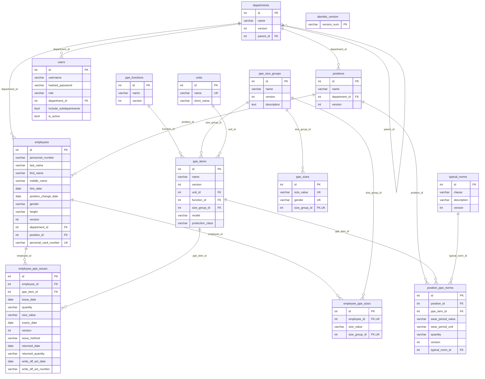

# Схема базы данных PPE Tracker

Диаграмма Visio: `docs/ppe-tracker-db-schema.vsdx`.
Перегенерация (обе схемы сразу): `.venv/bin/python docs/make_er_diagram.py`

```mermaid
erDiagram
    departments ||--o{ departments : "parent_id"
    departments ||--o{ employees : "department_id"
    departments ||--o{ positions : "department_id"
    departments ||--o{ users : "department_id"
    employees ||--o{ employee_ppe_issues : "employee_id"
    employees ||--o{ employee_ppe_sizes : "employee_id"
    positions ||--o{ employees : "position_id"
    positions ||--o{ position_ppe_norms : "position_id"
    ppe_functions ||--o{ ppe_items : "function_id"
    ppe_items ||--o{ employee_ppe_issues : "ppe_item_id"
    ppe_items ||--o{ position_ppe_norms : "ppe_item_id"
    ppe_size_groups ||--o{ employee_ppe_sizes : "size_group_id"
    ppe_size_groups ||--o{ ppe_items : "size_group_id"
    ppe_size_groups ||--o{ ppe_sizes : "size_group_id"
    typical_norms ||--o{ position_ppe_norms : "typical_norm_id"
    units ||--o{ ppe_items : "unit_id"
    alembic_version {
        varchar version_num "PK"
    }
    departments {
        int id "PK"
        varchar name
        int version
        int parent_id "FK"
    }
    employee_ppe_issues {
        int id "PK"
        int employee_id "FK"
        int ppe_item_id "FK"
        date issue_date
        varchar quantity
        varchar size_value
        date expiry_date
        int version
        varchar issue_method
        date returned_date
        varchar returned_quantity
        date write_off_act_date
        varchar write_off_act_number
    }
    employee_ppe_sizes {
        int id "PK"
        int employee_id "FK,UK"
        varchar size_value
        int size_group_id "FK,UK"
    }
    employees {
        int id "PK"
        varchar personnel_number
        varchar last_name
        varchar first_name
        varchar middle_name
        date hire_date
        date position_change_date
        varchar gender
        varchar height
        int version
        int department_id "FK"
        int position_id "FK"
        varchar personal_card_number "UK"
    }
    position_ppe_norms {
        int id "PK"
        int position_id "FK"
        int ppe_item_id "FK"
        varchar wear_period_value
        varchar wear_period_unit
        varchar quantity
        int version
        int typical_norm_id "FK"
    }
    positions {
        int id "PK"
        varchar name
        int department_id "FK"
        int version
    }
    ppe_functions {
        int id "PK"
        varchar name
        int version
    }
    ppe_items {
        int id "PK"
        varchar name
        int version
        int unit_id "FK"
        int function_id "FK"
        int size_group_id "FK"
        varchar model
        varchar protection_class
    }
    ppe_size_groups {
        int id "PK"
        varchar name
        int version
        text description
    }
    ppe_sizes {
        int id "PK"
        varchar size_value "UK"
        varchar gender "UK"
        int size_group_id "FK,UK"
    }
    typical_norms {
        int id "PK"
        varchar clause
        varchar description
        int version
    }
    units {
        int id "PK"
        varchar name "UK"
        varchar short_name
    }
    users {
        int id "PK"
        varchar username
        varchar hashed_password
        varchar role
        int department_id "FK"
        bool include_subdepartments
        bool is_active
    }
```
